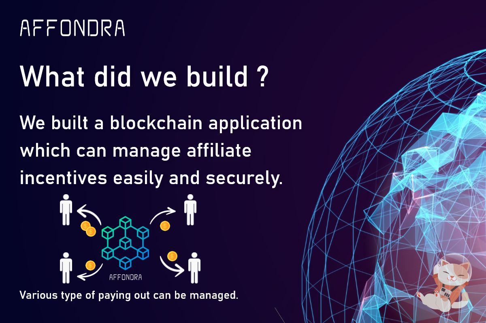
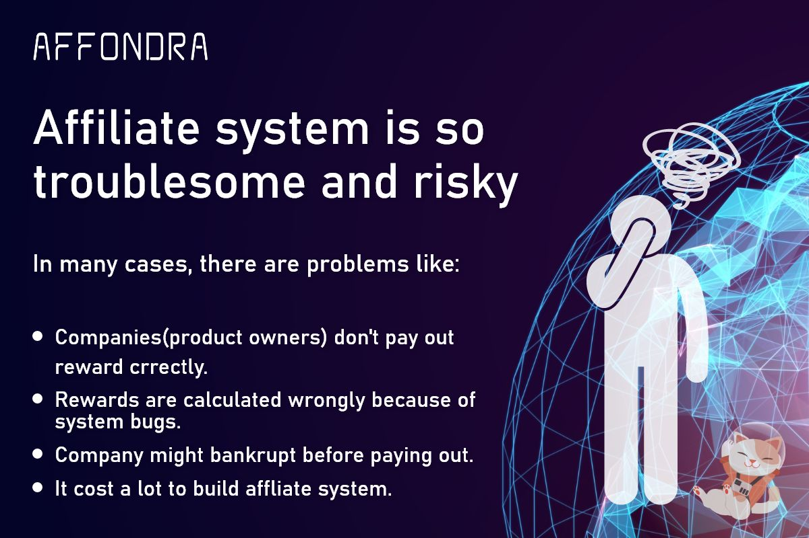
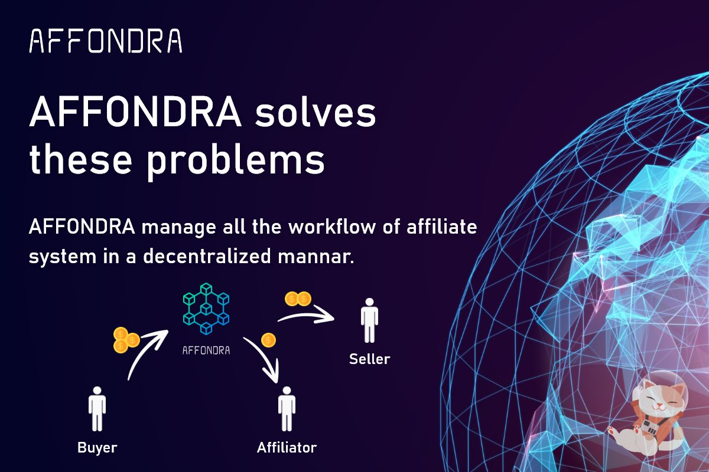
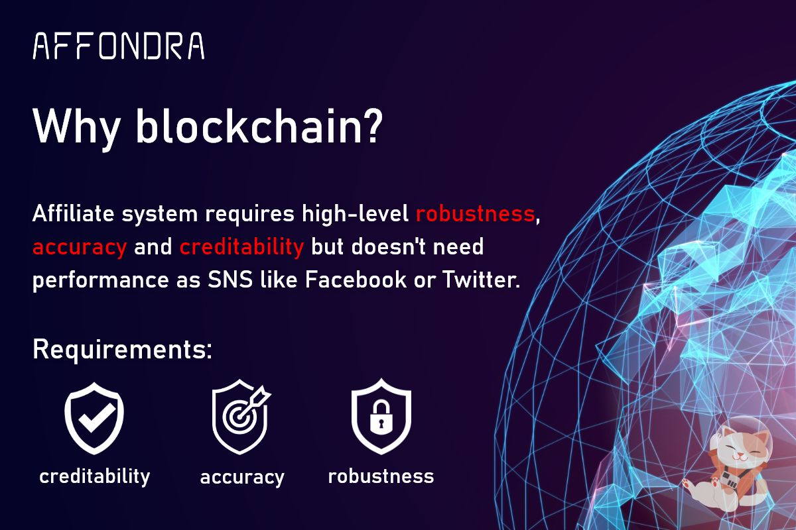
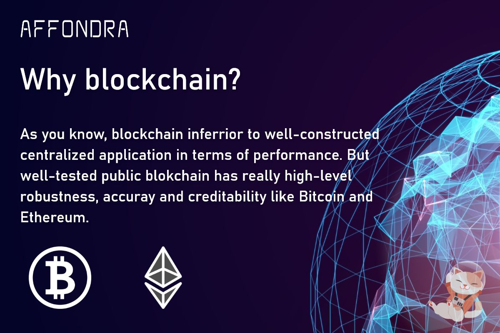
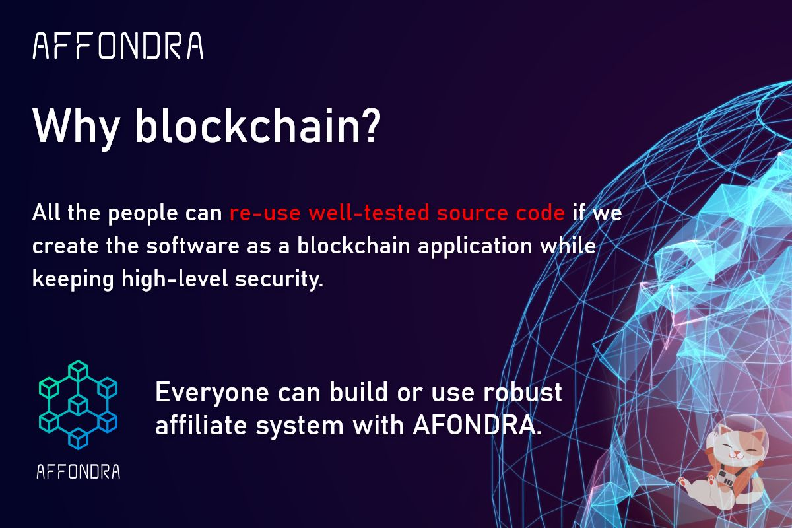
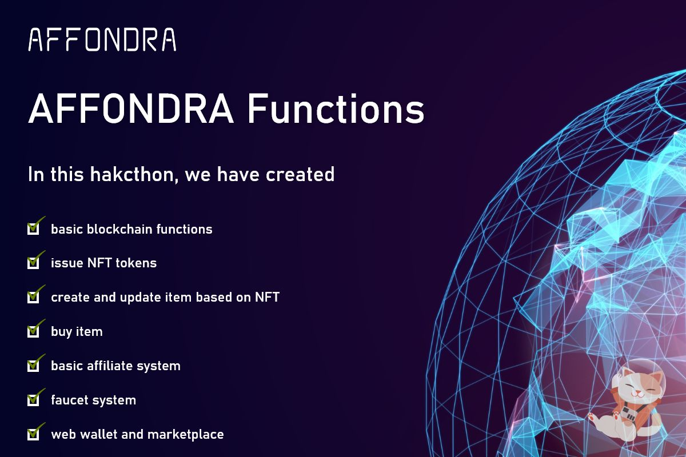
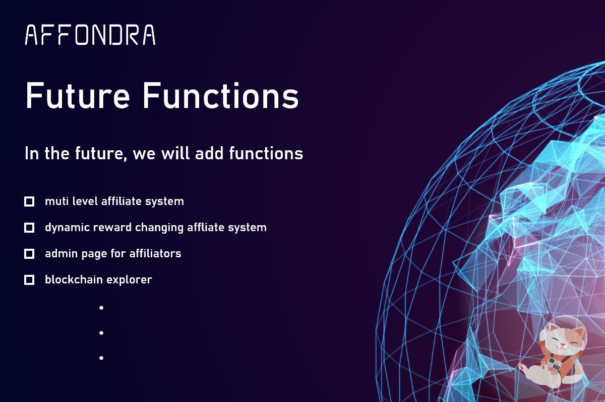
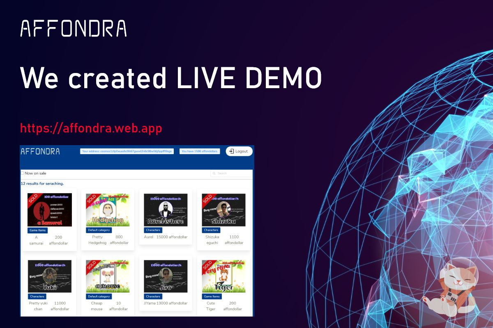
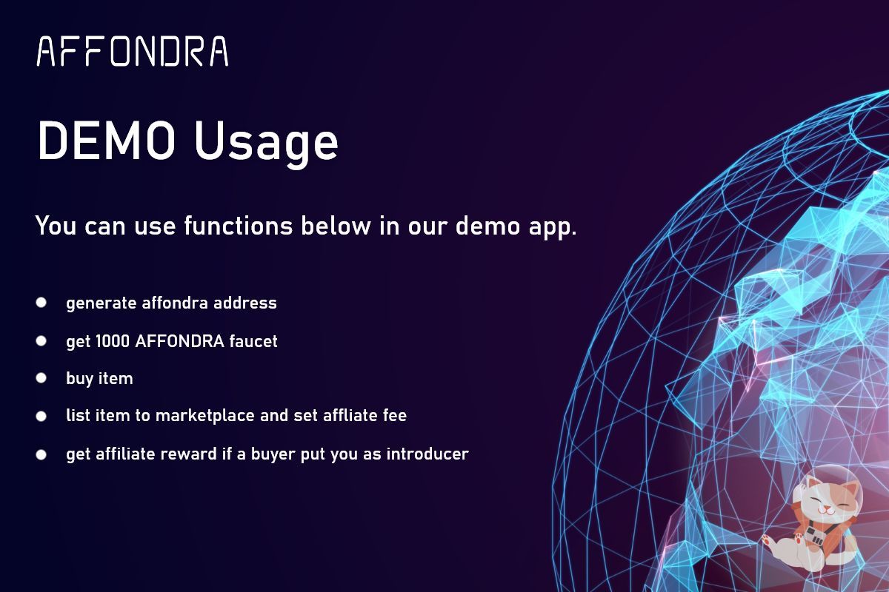

# affondra

**affondra** is a blockchain application built using Cosmos SDK and Tendermint and generated with [Starport](https://github.com/tendermint/starport).

## Get started

```
starport serve
```

`serve` command installs dependencies, initializes and runs the application.

## Configure

Initialization parameters of your app are stored in `config.yml`.

### `accounts`

A list of user accounts created during genesis of your application.

| Key   | Required | Type            | Description                                       |
| ----- | -------- | --------------- | ------------------------------------------------- |
| name  | Y        | String          | Local name of the key pair                        |
| coins | Y        | List of Strings | Initial coins with denominations (e.g. "100coin") |

## Learn more

- [Starport](https://github.com/tendermint/starport)
- [Cosmos SDK documentation](https://docs.cosmos.network)
- [Cosmos Tutorials](https://tutorials.cosmos.network)
- [Channel on Discord](https://discord.gg/W8trcGV)

## Presentation

1

2

3

4

5

6

7

8

9

10

11

12
