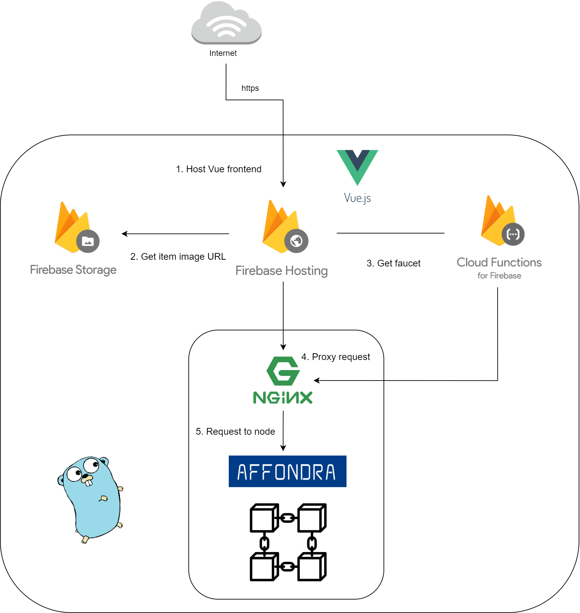

# affondra

<p align="center">
  
</p>

[](https://github.com/EG-easy/affondra/releases/latest)
[](https://goreportcard.com/report/github.com/EG-easy/affondra)

Affondra is a blockchain application using [cosmos-sdk](https://github.com/cosmos/cosmos-sdk) that anyone can use when trading NFT items. Users can sell their NFT item peer to peer, and the person who introduce the items can earn affiliate reward in Affondra market.

# Implementation
## Completed
:heavy_check_mark: basic blockchain functions
:heavy_check_mark: issue NFT token
:heavy_check_mark: create Item based on NFT
:heavy_check_mark: update Item infomation
:heavy_check_mark: buy Item
:heavy_check_mark: affiliate system
:heavy_check_mark: faucet system
:heavy_check_mark: web wallet

Firstly, watch [Demo]()!

## Install
### affondrad & affondracli
**requirement**
Go 1.15+ is required for the Cosmos SDK.

```bash
$ git clone github.com/EG-easy/affondra.git
$ cd affondra && git checkout -b [branch] tags/[latest release tag]
$ make
```

Try `affondracli version` and `affondrad version` to verify everything is OK!

### *Initialize configuration files and genesis file**

Just use shell scripts bellow.
```
$ sh scripts/start.sh
```

**Now let's start!**
```bash
$ affondrad start
```

## Play with CLI

### Mint NFT
Firstly, you need to mint(or receive) a NFT.
When creating NFT, you can modify the denom, nft id, description, tokenURI.

```bash
$ affondracli tx nft mint your-favorite-denom random-nft-id $(affondracli keys show -a user1) --tokenURI http://metadata.com --from user1 -y
```

### Create Item
Now you have a NFT and you can sell it as a Item in the Affondra trading market. Just set the price you want to sell and affiliate reward for those who promote your item.

```bash
$ affondracli tx affondra create-item your-favorite-denom random-nft-id 1000affondollar 10affondollar This item is Awesome! true --from=user1 -y
```

### Buy Item
Now your friend A introduces the item to your friend B, and friend B bought the item with the command below. Then you will get 990affondollar and your friend will get 10affondollar as a affiliate reward, and B will successfully receive the NFT from you.
```bash
$ affondra tx buy-item random-nft-id B'address A'address --from B -y
```

## API endpoint (Swagger)
You can refer to the api endpoint of Affondra chain.

## System architecture
<p align="center">
  
</p>

0. Develop Affondra blockchain application with [Starport](https://github.com/tendermint/starport).
1. Use [Firebase Hosting](https://firebase.google.com/docs/hosting) to host [Vue](https://vuejs.org/) application.
2. Use [Firebase storage](https://firebase.google.com/docs/storage) to keep item images that users uploaded.
3. Use [Firebase cloud functions](https://firebase.google.com/docs/functions) to set a ffaucet function. The faucet account mnemonic keys are stored in the cloud service so that users can get faucet with no time and try our product quickly.
4. Nginx is used for load balancing and cors setting. It seems that rest server won't response to `OPTIONS` method request so we proxy frontend request in Nginx server.
5. Affondra module is originally created to trade NFT, to motivate affliate, and to certify correct payment..

## License
Licensed under the [MIT](LICENSE).
